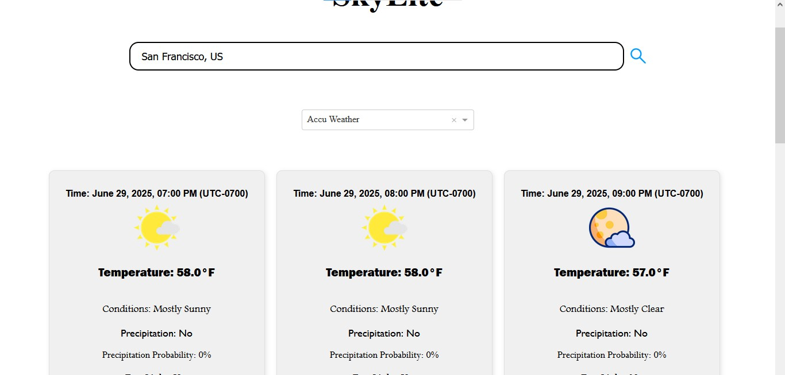

# SkyLite: Your Clear View of the Skies, Anytime, Anywhere



<br>

## The Foundation

### Value Proposition

* Skylite is a simple yet powerful web application built with Dash that provides up-to-date weather forecasts from multiple sources.

* It aims to empower users with immediate access to crucial weather data, helping them plan their day with confidence, whether for travel, outdoor activities, or simply staying informed about local conditions.

* Its intuitive interface and visual data representation make complex weather data easily digestible for everyone.

 
### Badge
**License:** [MIT License](https://opensource.org/license/mit)


## Getting Started

### Skip The Setup: Just Click
Click [SkyLite](https://huggingface.co/spaces/Machini/WeatherLens)

### Detailed Configuration Steps
To set up and run SkyLite locally, follow these steps:

**Prerequisites**

1.  Python 3.11.4 (or compatible version)

2.  pip (Python package installer)

3.  **API Keys for AccuWeather and OpenWeather.** For secure deployment (e.g., on Hugging Face Spaces) and to prevent exposing your keys in a public repository, these are loaded from environment variables.  
For further details on obtaining and configuring these APIs, please refer to the **API Documentation section** below.

    * **For Deployment (e.g., Hugging Face Spaces):** You will set `ACCUWEATHER_API_KEY` and `OPENWEATHER_API_KEY` as "Secrets" in your Space's settings.
    
    * **For Local Development:** Create a `.env` file in the root of your project (and ensure it's in your `.gitignore`) with the following content:
    
        ```
        ACCUWEATHER_API_KEY=YOUR_ACCUWEATHER_API_KEY
        OPENWEATHER_API_KEY=YOUR_OPENWEATHER_API_KEY
        ```
        
        You will also need to install `python-dotenv` (`pip install python-dotenv`) and add `from dotenv import load_dotenv; load_dotenv()` at the beginning of your `SkyLite.py` file to load these variables locally.
<br>

**Installation**

Step 1: *Clone the repository (if applicable):*

```bash
git clone https://github.com/Asmit-cloud/SkyLite.git
cd SkyLite
```

Step 2: *Create a virtual environment (recommended):*

```bash
python -m venv venv
source venv/bin/activate  # On Windows: `venv\Scripts\activate`
```

Step 3: *Install dependencies:*

```bash
pip install -r requirements.txt
```

**Running the Application**

1. **Ensure assets folder exists:** Create an assets folder in the same directory as SkyLite.py.

2. **Set Up API keys:**

API keys are loaded from environment variables for secure management.

* **For local development:** Create and configure a `.env` file in your project's root directory, as detailed in the **Prerequisites** section.
    
* **For deployment (e.g., Hugging Face Spaces):** Set your API keys as secrets in the platform's settings, as described in the **Prerequisites** section.

3. **Add icons:**

The application expects weather icons to be present in `assets/Image/AccuWeatherIcons` and `assets/Image/OpenWeatherIcons`.
<br>
You'll need to populate these folders with the necessary images as referenced in the SkyLite.py file. (e.g., SearchButtonImage.png, AW_RGB_R.png, and the various weather icons).


You can use placeholder images if you don't have the exact icons.

4. **Run the Dash app:**

```bash
python SkyLite.py
```

The application will typically be accessible at http://127.0.0.1:8050/ in your web browser.

### Usage

After launching the application, you can interact with it as follows:

1. **Input Search Query:** Type the name of a city and its country code (e.g., "London, GB") into the search bar.

2. **Select Data Source:** Use the dropdown to switch between "Open Weather" and "Accu Weather" to get the data from different providers.

3. **View Results:** The application will display a series of weather cards showing hourly forecasts.

4. **Attribution Details:** Click on "Sources and Attribution Details for Images" in the footer to reveal the sources of the icons and other assets used in the application for that particular weather source.


## Unveiling the Features


### Key Features

**Global Weather Search:** Easily search for weather information by entering a city and country code.

**Multiple Data Sources:** Choose between weather data from OpenWeather and AccuWeather for comprehensive insights.

**Detailed Forecasts:** View hourly forecasts including temperature, conditions, precipitation probability, and daylight status.

**Interactive Graphs:** Visualize temperature, humidity, dew point, and wind speed trends over time with interactive plots.

**Responsive Design:** Enjoy a seamless experience across various devices and screen sizes.

**Attribution Transparency:** Clearly displays attribution for all data sources and icons used.


### Usage Examples

1. *Simple Scenarios*

**Checking Current City Weather:** Open the app, type London, UK into the search bar, select Open Weather from the dropdown, and hit enter or click the search icon. You'll instantly see the 3-hour interval forecast cards and interactive graphs.

**Comparing Data Sources:** After viewing London, UK with Open Weather, simply switch the dropdown to Accu Weather to see how the forecast might differ, without needing to re-enter the city.

2. *Advanced Scenarios*

The interactive Plotly graphs allow you to zoom in on specific time periods by clicking and dragging, or pan across the data. Double-click to reset the view. This is useful for analyzing specific hourly trends.


## Diving Deeper


### Technical Stack
1. **Python 3.11.4:** Core programming language.

2. **Dash:** Python framework for building analytical web applications.

    * `dash.html`: For HTML layout.

    * `dash.dcc`: For interactive components like dropdowns and graphs.

3. **Plotly Graph Objects (`plotly.graph_objects`):** For creating interactive and detailed weather graphs.

4. **Requests:** For making HTTP requests to external weather APIs (AccuWeather and OpenWeather).

5. **PyTZ (`pytz`):** For accurate timezone handling.

6. **TimezoneFinder (`timezonefinder`):** For determining timezone from geographical coordinates.

7. **JSON:** For handling API keys and attribution data.


### Project Structure

```
├── assets/ 
│   ├── AccuWeatherIcons/      
│   │   ├── Sunny_(1).png
│   │   ├── MostlySunny_(2)
│   │   ├── PartlySunny_(3)
│   │   └── ...
│   ├── api_keys
│   │      └── apiKeyWeatherForecast.json # Your API keys
│   ├── Attributions
│   │        └── aw_attributions.json
│   │        └── ow_attributions.json
│   ├── css
│   │    └── style.css
│   ├── Image
│   │      └── AW_RGB_R.png
│   │      └── Image.jpg
│   │      └── SearchButtonImage.png
│   ├── OpenWeatherIcons/      
│   │   ├── ClearSkyDay_(01d).png
│   │   ├── ClearSkyNight_(01n)
│   │   ├── FewCloudsDay_(02d)
│   │   └── ...
├── LICENSE
├── README.md
├── requirements.in
├── requirements.txt
└── SkyLite.py 
```


### API Documentation

SkyLite uses the following external APIs:

1. **AccuWeather API:**

    * Location Search API (`/locations/v1/cities/search`)
    * The 12-Hour Hourly Forecast API (`/forecasts/v1/hourly/12hour/{location_key}`).
    
    Please refer to the [AccuWeather Developer Documentation](https://developer.accuweather.com/documentation) for full details.

2. **OpenWeatherMap API:**

    * The Geocoding API (`/geo/1.0/direct`)
    * The 5 day / 3 hour forecast API (`/data/2.5/forecast`).
    
    Please refer to the [OpenWeatherMap API Documentation](https://openweathermap.org/api) for full details.


## Contributing and Support


### How to Contribute

Contributions are welcome!

If you have suggestions for improvements, bug reports, or new features, please feel free to:

1. Fork the repository.

2. Create your feature branch.

3. Commit your changes.

4. Push to the branch.

5. Open a Pull Request.

### Code of Conduct
Please review the [Code of Conduct](CODE_OF_CONDUCT.md) before contributing. We aim to foster an open and welcoming environment.

### Support Channels
For questions, bug reports, or feature requests, please open an issue on the project's GitHub Issues page.


## Essential Information


### License
This project is licensed under the [MIT License](LICENSE).

### Author and Acknowledgments

* **Author:** Asmit De.

* **Weather Data:**

    * AccuWeather: [https://www.accuweather.com/](https://www.accuweather.com/)

    * OpenWeather: [https://www.openweathermap.org](https://www.openweathermap.org/)

* **Icons:**

    * Magnifying glass icons created by [chehuna - Flaticon](https://www.flaticon.com/free-icons/magnifying-glass)

    * Specific weather icons sourced from AccuWeather and OpenWeather APIs (refer to `assets/Attributions/aw_attributions.json` and `assets/Attributions/ow_attributions.json` files for details).

### Contact Information
For direct inquiries, you can [email me](mailto:byte.100.tron@gmail.com).
